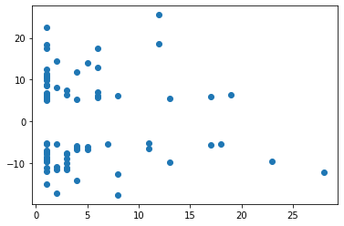
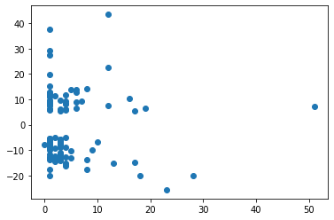
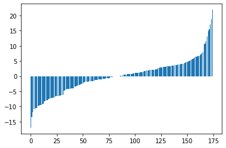
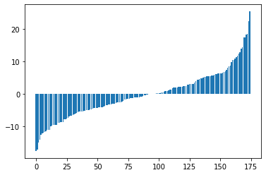
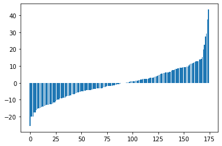

## 读取交割单


```python
import pandas as pd

df = pd.read_csv('交割单.csv')
print(df.head())
```

           成交日期    证券代码    证券名称 买卖标志    成交价格  成交数量     成交金额      发生金额    佣金  \
    0  20190710  510500  500ETF   买入   5.235  6900  36121.5 -36128.72  7.22   
    1  20190710  510500  500ETF   买入   5.236  4000  20944.0 -20949.00  5.00   
    2  20190710     878    云南铜业   买入   9.900  2000  19800.0 -19805.00  5.00   
    3  20190711     878    云南铜业   卖出  10.070 -1000  10070.0  10054.93  5.00   
    4  20190711     878    云南铜业   卖出  10.160 -1000  10160.0  10144.84  5.00   
    
         印花税  过户费  其他费     成交编号        股东代码    备注    手续费  
    0   0.00  0.0    0  4091881  A534878327  证券买入   7.22  
    1   0.00  0.0    0  6083502  A534878327  证券买入   5.00  
    2   0.00  0.0    0    99386   268955131  证券买入   5.00  
    3  10.07  0.0    0    31351   268955131  证券卖出  15.07  
    4  10.16  0.0    0    81106   268955131  证券卖出  15.16  


## 单个标的收益情况


```python
dfEarn = df.groupby('证券名称')['发生金额'].sum().reset_index().sort_values('发生金额')

print(dfEarn)
```

         证券名称     发生金额
    6    万达电影 -6694.69
    50   安信信托 -6616.34
    32  半导体50 -4430.55
    7    世嘉科技 -3291.95
    11   中国人寿 -3017.28
    ..    ...      ...
    44   均胜电子  4418.44
    81   美年健康  5297.35
    59   拓普集团  6833.51
    74   环旭电子  8190.13
    18   中曼石油  9644.01
    
    [99 rows x 2 columns]


## 单个标的收益分布


```python
import matplotlib.pyplot as plt

plt.bar(dfEarn['证券名称'], dfEarn['发生金额'])

plt.show()
```


## 一些简单统计


```python
import numpy as np

print('完成收益：', np.sum(dfEarn['发生金额']))

positive = list(filter(lambda x: x >= 0, dfEarn['发生金额']))

print('平均正收益：', np.mean(positive))

negative = list(filter(lambda x: x < 0, dfEarn['发生金额']))

print('平均负收益：', np.mean(negative))

print('操作标的数：', len(dfEarn))

print('成功率：', len(positive) / (len(dfEarn['发生金额'])))

```

    完成收益： 1081.609999999946
    平均正收益： 1633.4602380952372
    平均负收益： -1184.6266666666672
    操作标的数： 99
    成功率： 0.42424242424242425


```python
### 获取历史行情
def getHis(stockCode, date, days):
    start = date
    end = (parse(str(date)) + datetime.timedelta(days=days)).strftime("%Y%m%d")
    
    stock = str(stockCode)
    if len(stock) == 4:
        stock = '00' + stock
    elif len(stock) == 3:
        stock = '000' + stock
    elif len(stock) == 2:
        stock = '0000' + stock
    elif len(stock) == 1:
        stock = '00000' + stock
        
    url = 'http://q.stock.sohu.com/hisHq?\
code=cn_%s&start=%s&end=%s&stat=1\
&order=D&period=d&callback=historySearchHandler&rt=json'%(stock, start, end)
    r = requests.get(url, headers={'Connection':'close'}, timeout=None)
    
    json = r.json();
    rslt = None;
    if type(json).__name__ == 'dict':
#         print(url, json);
        return None

    stat = json[0].get('stat');
    if stat is None:
        return None
    rslt = float(stat[3].replace('%', ''))
    
    return rslt
```

## 持仓时长和收益的关系


```python
import datetime
import requests
from dateutil.parser import parse

buys = []
batches = []
for index, row in df.iterrows():
#     if row[2] != '均胜电子': continue
    buyed = list(filter(lambda x: x[2] == row[2], buys))
    if len(buyed) > 0:
        buyedOne = buyed[0]
        # 剩余股数
        left = buyedOne[5] + row[5]
        # 持仓金额
        position = buyedOne[17];
        if row[3] == '买入':
            position = position + row[5] * row[4]
        else:
            position = position - row[5] * row[4]
        
        if position > buyedOne[18]:
            buyedOne[18] = position

#         print(row[2], left)
        if left == 0:
            # 清仓回测
            clearDate = row[0];
            # 后5天
            later5 = getHis(row[1], row[0], 5)
            # 后10天
            later10 = getHis(row[1], row[0], 10)
            # 后20天
            later20 = getHis(row[1], row[0], 20)
            
            batches.append([buyedOne[2], (parse(str(row[0])) - parse(str(buyedOne[0]))).days,
                            buyedOne[7] + row[7], buyedOne[15] + row[15],
                            buyedOne[16] + 1, buyedOne[18],
                            later5, later10, later20
                           ]
                          )
            buys = list(filter(lambda x: x[2] != row[2], buys))
        else:
            buyedOne[5] = left # 成交数量累积
            buyedOne[7] += row[7] # 发生金额累积
            buyedOne[15] += row[15] # 手续费累积
            buyedOne[16] += 1 # 交易次数
    else:
        buys.append(list(row) + ([0, row[5] * row[4], row[5] * row[4]]))
        
#     print(buys);
#     print(batches);
#         if index == 20: break;
        
pdDuration = pd.DataFrame(batches).sort_values(1)
print(pdDuration)

pdDuration.to_csv('batches.csv')
```

             0   1        2        3   4         5      6      7      8
    94    华宝油气   0   -21.74    21.74   1  108698.0  -2.56  -2.56  -7.69
    0     云南铜业   1   394.77    35.23   2   29960.0   3.83   9.87   5.84
    114   天味食品   1   163.87    59.13   4   40870.0  -1.62  10.47   2.42
    107   信隆健康   1  -695.59    28.59   1   37845.0   1.04   0.30  -7.91
    106   浪潮信息   1   432.81    23.19   1   25926.0  11.48  11.46   2.45
    ..     ...  ..      ...      ...  ..       ...    ...    ...    ...
    35    盛达资源  18  3778.70   196.30  12   75699.0  -6.54  -5.43 -20.14
    71   证券ETF  19  1000.75    54.65   6   84712.8   3.23   6.45   6.45
    95    安信信托  23 -6616.34   136.34   6   64843.0  -9.58  -9.58 -25.55
    90    长安汽车  28  4022.88    74.12   3   58363.0  -7.48 -12.02 -20.04
    62    天齐锂业  51  -251.05  1012.05  47   89923.0  -1.74   1.96   7.31
    
    [178 rows x 9 columns]


### 持仓时间分布


```python
gpDuration = pdDuration.groupby(1)[2]

series = gpDuration.size().reset_index()

plt.bar(series[1], series[2])
plt.show()
```


### 持仓时长与收益分布


```python
plt.scatter(pdDuration[1], pdDuration[2])
plt.show()
```


### 交易次数与收益分布


```python
plt.scatter(pdDuration[4], pdDuration[2])
plt.show()
```


### 持仓总额与收益分布


```python
plt.scatter(pdDuration[5], pdDuration[2])
plt.show()
```


### 持仓时长与清仓后的走势回归


```python
later5 = pdDuration[lambda x: abs(x[6]) > 5]
plt.scatter(later5[1], later5[6])
plt.show()

later10 = pdDuration[lambda x: abs(x[7]) > 5]
plt.scatter(later10[1], later10[7])
plt.show()

later20 = pdDuration[lambda x: abs(x[8]) > 5]
plt.scatter(later20[1], later20[8])
plt.show()
```








```python
plt.bar(range(pdDuration.shape[0]), pdDuration[6].sort_values(0))
plt.show()

plt.bar(range(pdDuration.shape[0]), pdDuration[7].sort_values(0))
plt.show()

plt.bar(range(pdDuration.shape[0]), pdDuration[8].sort_values(0))
plt.show()
```











```python

```
